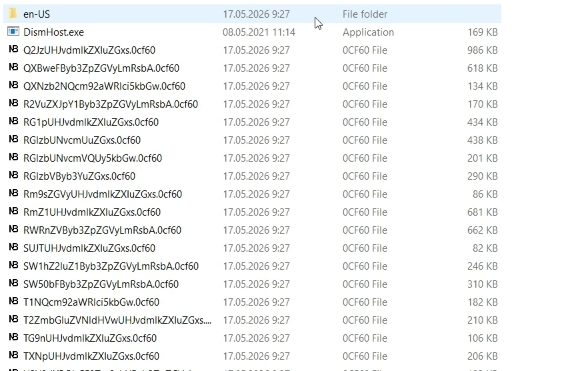
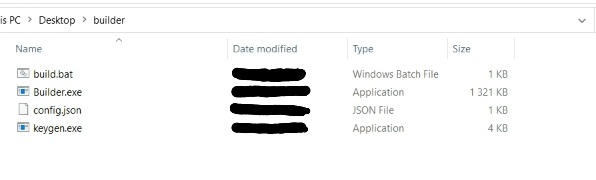
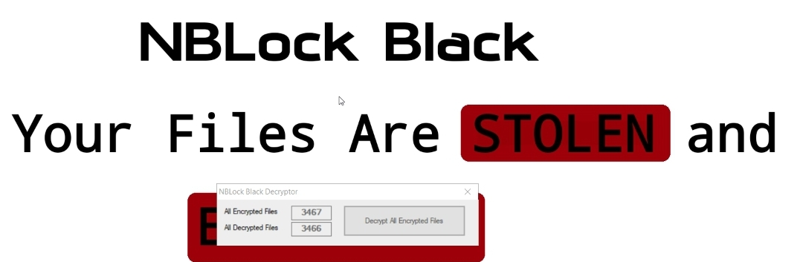

# NBLock-Black-Ransomware-Builder
Builder for NBLock Black Ransomware
| Project | NBLock Black Builder |
| :--- | :--- |
| **Framework** | .NET 4+ |
| **IDE** | Nano |

## Warning
!THIS IS NOT A CRACK OR A LEAK THIS IS THE OFFICIAL REPO FOR  NBLOCK BLACK BUILDER!

**_THE PICTURES LISTED BELOW MIGHT BE OUTDATED!_**
## Source's
[LockBIT Black Builder files Github Repository](https://github.com/Tennessene/LockBit)
/
[Splunk 2022 ransomware Encryption speed Comparison](https://www.splunk.com/en_us/blog/security/gone-in-52-seconds-and-42-minutes-a-comparative-analysis-of-ransomware-encryption-speed.html)
/
[Online IL/.NET/C# Decompiler](https://decompiler.com/)
## README
By analysing LockBit 3.0 Black (LB3) Ransomware
i made a copycat of it in C#,
i know the code is pretty gross and yes i did get help from AI (pls dont bully me over it).
the Binaries included in The zip file are fully C# & Decompilable With Dnspy/ILspy/[Online Decompiler](https://decompiler.com)
## Encrypted Files [File icon Set true]

## Builder Files

Same As LB3's Builder files.
## Decryptor UI 

i spent a LOT of time on copy'ing LB3's Decryptor UI.
## Nerdy Stuff
_**(some Features left in v0.1.5 and before)**_

 [ THIS PART IS AI GENERATED BECAUSE IM LAZY, BASICLY ITS FAST,UNIQUE AND SECURE (AES 256 CBC, RSA-2048) ]

> ​Hybrid Encryption: AES-256-CBC file encryption combined with RSA-2048 key wrapping.

> ​Session Unique Keys: Dynamic AES key and IV generated per execution, saved encrypted inside a hidden key.bin file.

​Intermittent Encryption: Full encryption with PKCS7 padding for files under 100MB; chunked stepped encryption with NoPadding for files over 100MB to optimize performance.

> ​Custom File Footer: Appends a 5-byte structural identifier consisting of the NBL! ASCII marker and the active mode byte.
 
> Optimized Multi-Threading: Parallel traversal engine auto-scaled to CPU Cores multiplied by 1.5, bounded to a minimum floor of 4 concurrent threads.

> ​Shadow Copy Deletion: Invokes hidden system utilities including vssadmin, wbadmin, and reagentc to destroy system backups and restore points.

​Boot Configuration Modification: Alters system boot policy to disable Windows Recovery Environment, Safe Mode configurations, and the Windows Error Reporting Service (WerSvc).

> ​Event Log Cleansing: Explicitly clears Application, System, Security, and Setup log channels to minimize forensic artifacts.

> ​Network and AV Invalidation: Appends entries to the local drivers/etc/hosts file to redirect critical security and antivirus update domains to loopback (127.0.0.1).

​Directory Whitelisting: Automatically skips critical operating system paths containing Windows or Microsoft, alongside extensions like .exe, .sys, and .dat.

> ​Network Share Discovery: Queries the MountPoints2 registry path to dynamically identify and enumerate connected network infrastructure and mapped drives.

​Registry Hijacking: Registers a unique file extension based on the hardware identifier, maps it to a custom icon resource, and forces a global shell refresh via native API calls.

> ​Desktop Persistence: Updates user desktop configuration paths via the registry to enforce a modified background wallpaper image.
 
## Educational Purposes Only

This repository and its contents are intended solely for academic research, educational purposes, and authorized security analysis. 

### Terms of Use

* **Strictly Educational:** The source code, concepts, and methodologies demonstrated in this repository are designed to help developers and security researchers understand binary structure, metadata manipulation, and assembly patching mechanics.
* **No Unauthorized Deployment:** The use of any concepts or artifacts derived from this project against systems without explicit, prior written authorization from the system owner is strictly prohibited.
* **No Liability:** This software is provided "as-is" without any express or implied warranty. Under no circumstances shall the author or contributors be liable for any direct, indirect, incidental, special, exemplary, or consequential damages, or legal repercussions arising from the use or misuse of this repository.
* **User Responsibility:** By downloading, cloning, or interacting with this repository, you assume full responsibility for your actions and compliance with all applicable local, national, and international laws.
